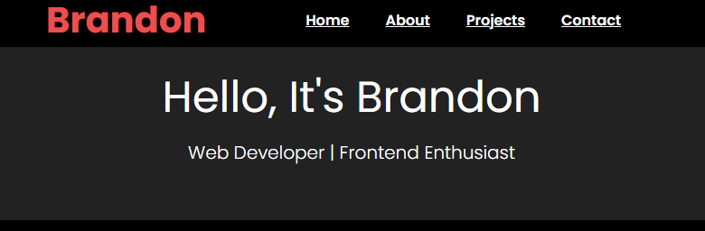

# Libraries
- HTML
- CSS

# Development Note

Menunjukkan portfolio riil kepada public. Ini bisa jadi bukti keterampilan saya yang tidak hanya ditulis di CV, tapi benar-benar bisa diakses, juga  Sebagai personal branding untuk menunjukkan profesionalisme dan skill di dunia nyata. 

## Home

Pada project portfolio ini, bagian Home berfungsi sebagai halaman pengantar atau landing page dan Memberikan impresi awal dengan desain yang bersih. 

## Introduction

Introduction saya buat untuk dengenalkan diri secara singkat dan menonjolkan kemampuan juga minat saya sebagai web developer.

## Project

Bagian project saya buat sebagai pengukur seberapa banyak saya berkembang dan bagaimana saya sudah belajar dari proyek yang saya buat sebelumnya.

## Contact

Memudahkan orang menghubungi saya secara langsung.

