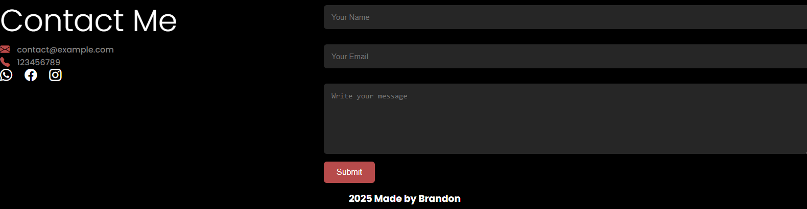

# Brandon responsive portofolio

Ini adalah responsif portofolio website yang saya mbuat menggunakan HTML, CSS, dan Javascript.

## Fitur 

- **Desain Responsive** — Bekerja di situs desktop dan Mobile.
- **Menu Navigasi** — Saya perbaiki menu Navbar supaya dapat digunakan untuk mobile device.
- **Home section** — Sebagai pesan selamat datang dan peran saya sebagai developer.
- **About me section** — Untuk menunjukan background dan juga skill saya.
- **Project Responsive** — Untuk menunjukan project yang sudah pernah saya buat.
- **Contact Responsive** — Kontak untuk social media supaya lebih mudah berkomunikasi dengan saya. 

### Home

Home section berisi perkenalan, juga untuk pesan selamat datang.

### About me

About section berisi tentang pengenalan lebih lanjut dan juga background tentang saya.

### Project

Bagian project saya buat sebagai pengukur seberapa banyak saya berkembang dan bagaimana saya sudah belajar dari proyek yang saya buat sebelumnya.

### Contact

Memudahkan orang lain untuk bisa berkomunikasi dengan saya.

